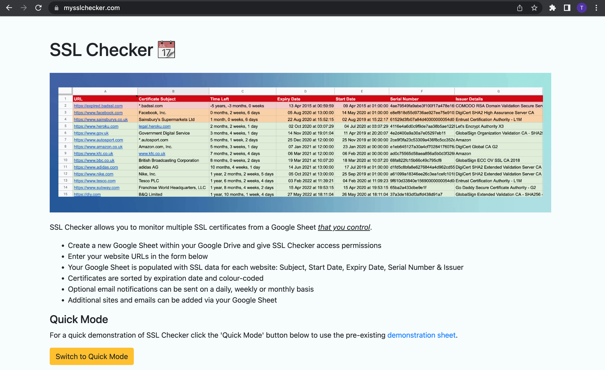

Examples of developed hobby applications and scripts:

## 1. SSL Checker

Retrieves SSL certificate data for a list of websites. Information is stored in the user’s personal Google Drive via the Google Sheets API. Includes configurable email alerts
| Technologies Used | URL / GitHub |
| ------------------------------------------------------------------------- | ----------------------------------------------------------------------------------------------------- |
| Python, Heroku (PaaS), Google Sheet API v3, HTML & CSS, JavaScript, Redis | [◉ Website](https://mysslchecker.com)  [◉ Github](https://github.com/rintin-tim/mysslchecker.git) |

#### Includes configurable email alerts

| Name               | Description                                                                                                                                                                                         | Technologies Used                                                                     | URL / GitHub                                                                                                                                            |
| ------------------ | --------------------------------------------------------------------------------------------------------------------------------------------------------------------------------------------------- | ------------------------------------------------------------------------------------- | ------------------------------------------------------------------------------------------------------------------------------------------------------- |
| SSL Checker        | Retrieves SSL certificate data for a list of websites. Information is stored in the user’s personal Google Drive via the Google Sheets API. Includes configurable email alerts                      | Python, Heroku (PaaS), Google Sheet API v3, HTML & CSS, JavaScript, Redis             | [https://mysslchecker.com](https://mysslchecker.com) / [https://github.com/rintin-tim/mysslchecker.git](https://github.com/rintin-tim/mysslchecker.git) |
| GetScreenshot      | Uses the BrowserStack screenshot API to return screenshots from selected browsers and devices for a list of URLs. Multiple API responses are compiled into a single slideshow for quick ease of use | Python, Heroku (PaaS), HTML & CSS, JavaScript, PostgreSQL, Redis DB, BrowserStack API | Available on request                                                                                                                                    |
| Input form printer | Prints existing form data to a new browser tab prior to form submission                                                                                                                             | JavaScript                                                                            | [https://github.com/rintin-tim/print_form](https://github.com/rintin-tim/print_form)                                                                    |
