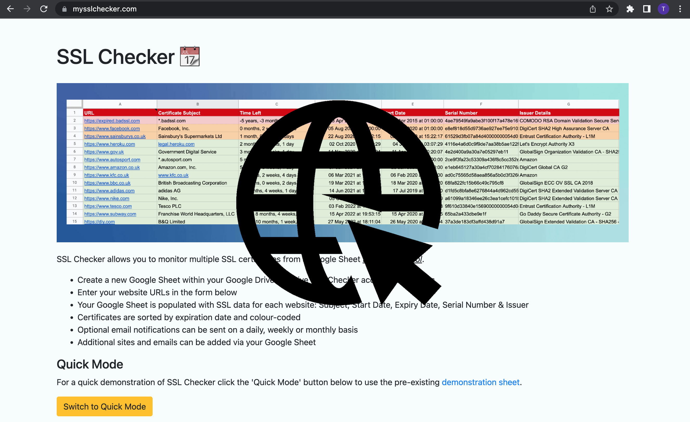

# Web Applications

### mysslchecker.com

Retrieves and categorises SSL certificate data for a given list of websites. The list is stored in the user’s personal Google Drive and accessed via the Google Sheets API. Includes configurable email alerts.



| Technologies Used                                                    |                                                        |
| -------------------------------------------------------------------- | ------------------------------------------------------ |
| Python, Heroku, Google Sheets API (v3), Redis, JavaScript, CSS, HTML | [• Github](https://github.com/rintin-tim/mysslchecker) |

### GetScreenshot

GetScreenshot takes screenshots for a list of URLs using multiple browsers and devices. It enhances Browserstack's native functionality by enabling users to bulk send a list of URLs which can be reviewed in a single custom slideshow.


 

| Technologies Used                                                                          |                                                        |
| ------------------------------------------------------------------------------------------ | ------------------------------------------------------ |
| Python, Heroku, Browserstack screenshot API, PostgreSQL, Redis, JavaScript, CSS, HTML, CSS | [• Github](https://github.com/rintin-tim/mysslchecker) |

# QA Tools

### Scripts to help with repetitive manual QA tasks

## Form printer

Print your current form data to a new browser tab before you submit it

| Technologies Used     |                                                      |
| --------------------- | ---------------------------------------------------- |
| JavaScript, HTML, CSS | [• Github](https://github.com/rintin-tim/print_form) |

## Domain toggle

Toggle between identical URL paths on two different domains - without manually and repetitively changing the URL in the browser.

This can be useful for comparing webpages across production and staging environments or across different regions.

_Example - switch between:_

- Test page: https://test.com/yellow-rubber-ducks
- Live page: https://live.com/yellow-rubber-ducks

| Technologies Used |                                                         |
| ----------------- | ------------------------------------------------------- |
| JavaScript        | [• Github](https://github.com/rintin-tim/domain_toggle) |

| Name          | Description                                                                                                                                                                                         | Technologies Used                                                                     | URL / GitHub         |
| ------------- | --------------------------------------------------------------------------------------------------------------------------------------------------------------------------------------------------- | ------------------------------------------------------------------------------------- | -------------------- |
| GetScreenshot | Uses the BrowserStack screenshot API to return screenshots from selected browsers and devices for a list of URLs. Multiple API responses are compiled into a single slideshow for quick ease of use | Python, Heroku (PaaS), HTML & CSS, JavaScript, PostgreSQL, Redis DB, BrowserStack API | Available on request |
